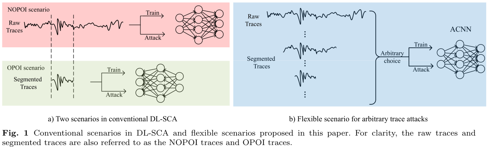

# Code for paper - ACNN: Arbitrary Traces Attack based on Leakage Area Detection

## *Arbitrary Traces Attack* is based on the flexible scenario (right side of Fig.1) in contrast to previous attacks which are based on the other two scenarios (left side of Fig.1). 
<!-- This type of attack has bypassed the limitations of previous attacks: 1) the need for aligning attack traces with the training ones under the OPOI scenario and 2) the difficulty of model convergence under the NOPOI scenario. -->

## Usage:
See [Exp_ASCAD.ipynb](./Exp_ASCAD.ipynb) and [Exp_DPAv4.ipynb](./Exp_DPAv4.ipynb)

